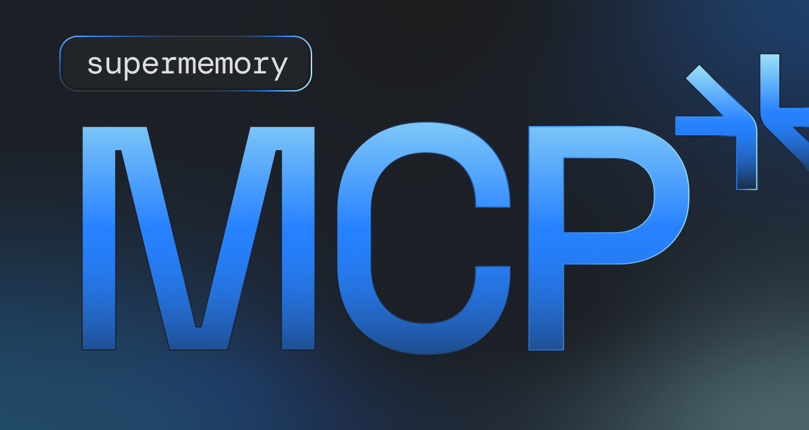

# Supermemory MCP - Universal Memory across LLMs

> [!WARNING] 
> MCP v1 is being deprecated. Please get the latest version from [app.supermemory.ai](https://app.supermemory.ai)

Click below for one click install with `.dxt`

Read a detailed blog about it - https://supermemory.ai/blog/the-ux-and-technicalities-of-awesome-mcps 

**Your memories are in ChatGPT... But nowhere else. Universal Memory MCP makes your memories available to every single LLM. No logins or paywall. One command to set it up.**

Which means you can carry your memories to any MCP client. and it just works!

## Demo (Click on the image for video!)

## Getting Started

To get started, just visit https://app.supermemory.ai, and follow the instructions on the page.

## Features

- 🚀 Built on top of the [Supermemory API](https://supermemory.ai), extremely fast and scalable.
- ✅ No login required
- 😱 Completely free to use
- Extremely simple setup.

## Self-hosting

To self host, get an API key at https://console.supermemory.ai, and then simply add it in the `.env` file with `SUPERMEMORY_API_KEY=`
